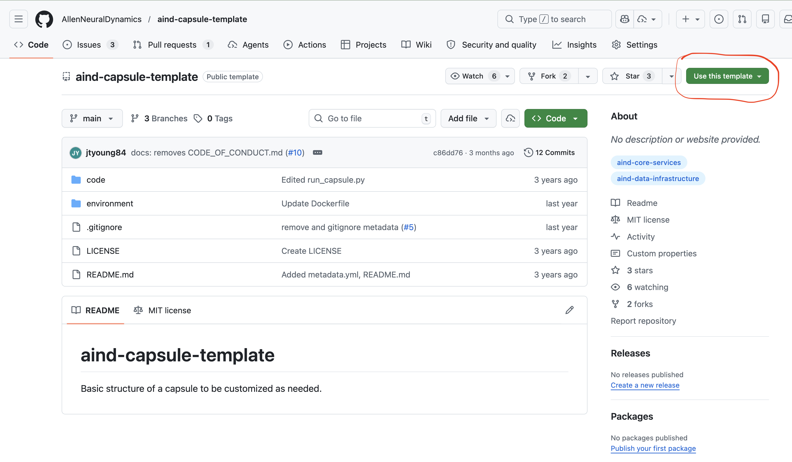
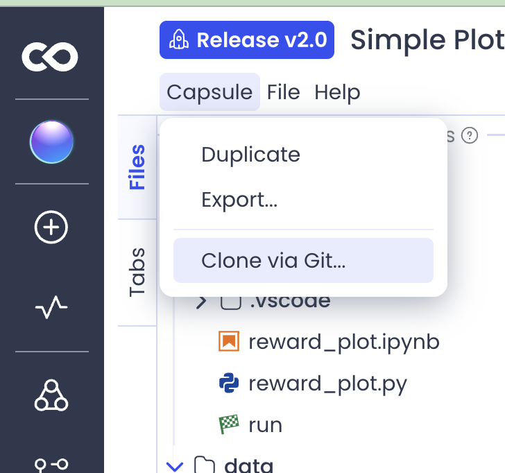
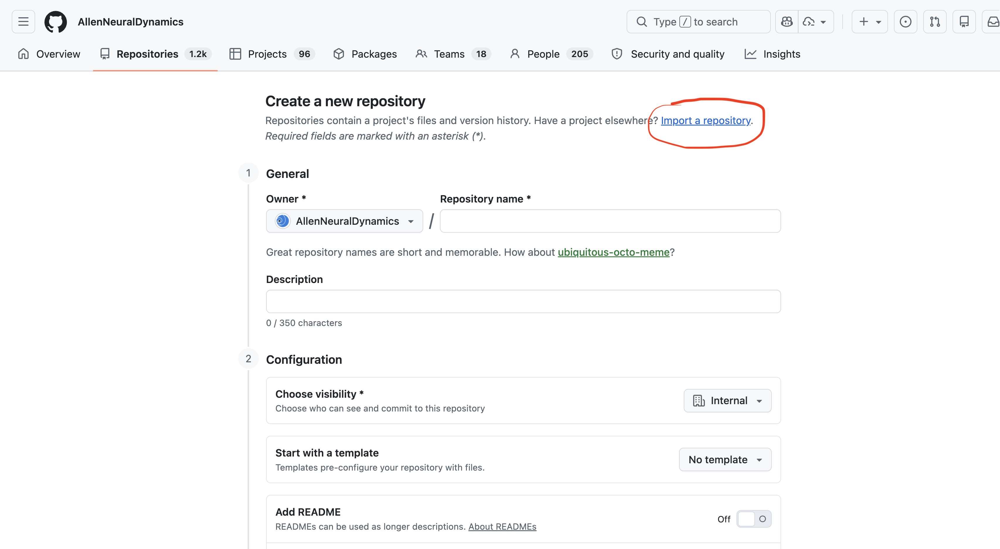
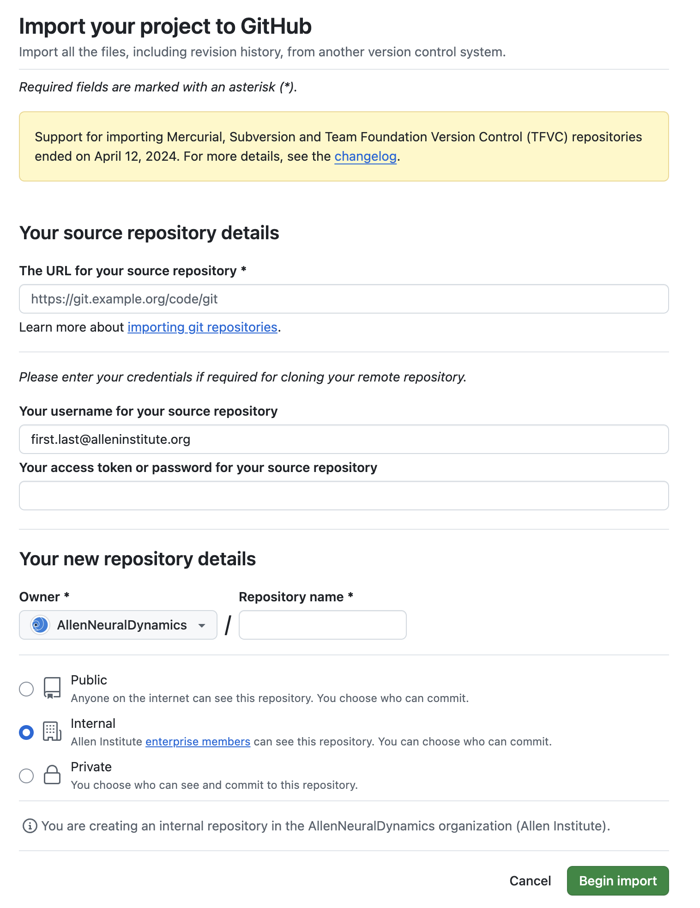

# GitHub-backed Code Ocean capsules

## Why GitHub backing matters

Linking a Code Ocean capsule to a GitHub repository provides an additional venue for sharing your code, environment configuration, and links to your data beyond Code Ocean itself. It also integrates your capsule into standard software development workflows — version history, code review, and discoverability via GitHub search — and makes it easier for others to find, cite, and build on your work.

## Creating a new capsule backed by a GitHub repo

The easiest way to ensure your capsule is GitHub-backed is to set this up at creation time. Code Ocean does not allow you to add GitHub backing to an existing capsule after it has been created (see [this issue](https://github.com/AllenNeuralDynamics/aind-code-ocean-info/issues/16)), so getting this right from the start avoids the more involved migration process described below.

Rather than creating a GitHub repo from scratch, you should start from the [aind-capsule-template](https://github.com/AllenNeuralDynamics/aind-capsule-template). This template provides the `code/` and `environment/` directory structure that Code Ocean requires. Creating a repo from scratch risks producing a layout that is incompatible with Code Ocean.

**Steps:**

1. Go to [https://github.com/AllenNeuralDynamics/aind-capsule-template](https://github.com/AllenNeuralDynamics/aind-capsule-template) and click the green **Use this template** button, then select **Create a new repository**.



2. Under **Owner**, select **AllenNeuralDynamics**. Give the repo a name and set visibility to **Internal** or **Public**.
3. Click **Create repository**.
4. Copy the HTTPS clone URL from the green **Code** button (e.g., `https://github.com/AllenNeuralDynamics/REPO_NAME.git`).
5. Go to [https://codeocean.allenneuraldynamics.org/dashboard](https://codeocean.allenneuraldynamics.org/dashboard), click **New Capsule**, and select **Clone From Git**.
6. Paste the URL from step 4 and click **Clone**.
7. Your capsule is now linked to your GitHub repo. Any changes committed and synced in Code Ocean will be reflected in the repo.

## Migrating an existing capsule to GitHub backing

If your capsule was created without GitHub backing, you cannot add it retroactively. Instead, you must import your capsule's code into a new GitHub repository, create a new Code Ocean capsule cloned from that repo, and deprecate the original capsule.

Broadly, the steps are:

**A)** Create a new GitHub repo from your existing capsule.  
**B)** Create a new capsule backed by this new repo.  
**C)** Create a new reproducible run and release from the new capsule.  
**D)** Deprecate the old capsule.  
 
From that point forward, all changes in the new capsule will automatically sync with the GitHub repo.

### A) Create a GitHub repo from your existing capsule


1. Click **Capsule > Clone via Git...** from the menu near the top of the Code Ocean interface.



2. Copy the URL under **Clone using this URL:** (it will look something like `https://codeocean.allenneuraldynamics.org/capsule-XXXXXXX.git`).
3. In a new tab, go to [https://github.com/AllenNeuralDynamics](https://github.com/AllenNeuralDynamics).
4. Click the green **New** button.
5. Click **Import a repository** near the top.





6. Paste the URL from step 2 into the **The URL for your source repository** field.
7. Enter your full Allen email address in the **Your username for your source repository** field.
8. Switch back to your Code Ocean tab. If there is a **Generate a user token** option, create a token and copy it.
9. Paste the token into the **Your access token or password for your source repository** field on GitHub. If Code Ocean did not offer a token, leave this field blank.
10. Under **Choose an owner**, select **AllenNeuralDynamics**.
11. Under **Repository name**, enter a name matching your capsule name.
12. Set visibility to either **Internal** or **Public**. You can change this later. But note that this must ultimately be set to **Public** to make the capsule repo visible to the outside world.
13. Click **Begin Import**. This can take several minutes to complete. (If this step fails, see [Troubleshooting: import credentials](#import-fails-due-to-incorrect-credentials).)
14. Once complete, click the link to go to your new repo.

### B) Create a new GitHub-backed capsule

15. Click the green **Code** button on your new GitHub repo and copy the HTTPS URL (e.g., `https://github.com/AllenNeuralDynamics/REPO_NAME.git`).
16. Go to [https://codeocean.allenneuraldynamics.org/dashboard](https://codeocean.allenneuraldynamics.org/dashboard), click **New Capsule**, and select **Clone From Git**.
17. Paste the URL from step 15 and click **Clone**. This creates your new GitHub-backed capsule.
18. Edit the README of the new capsule to include a link to the GitHub repo.
19. Commit your changes and click **Sync with GitHub**.
20. Go to your GitHub repo and verify that the README changes are visible there.

### C) Create a reproducible run and release

21. Create a new reproducible run and release from the new capsule. (If this step fails with a Dockerfile error, see [Troubleshooting: environment build](#environment-build-fails-with-git-askpass-not-found).)

### D) Deprecate the old capsule

22. Add a note to the original capsule's README stating that it is deprecated, and include a link to the new capsule. This is important so that you don't inadvertently continue working on the original capsule.
23. Consider renaming the original capsule to make its status clear (e.g., "My Capsule Title (deprecated)").

## Troubleshooting

### Import fails due to incorrect credentials

If GitHub reports an error after clicking **Begin Import** in step 13, the most likely cause is incorrect credentials. Check the following:

- **Username:** Use your full Allen Institute email address (e.g., `firstname.lastname@alleninstitute.org`), not your GitHub username.
- **Token:** If Code Ocean showed a **Generate a user token** option in step 8, you must paste that token into the password field — not your GitHub or Allen Institute password. Note that some capsules may import successfully without a token (typically public ones), while private capsules will fail without it. If some of your capsules imported and others did not, check whether the failing ones are private.

### Environment build fails with `"/git-askpass": not found`

You may see an error like this when running a reproducible run or rebuilding your capsule environment:

```
ERROR: failed to calculate checksum of ref ...: "/git-askpass": not found
```

**Why this happens:** Code Ocean switched its build system to Docker BuildKit, which builds images differently from classic Docker. As part of that migration, the credential helper file that Code Ocean injects into the Docker build context was renamed from `git-askpass` to `git-ask-pass`. The rename was intentional: BuildKit's layer caching would have continued reusing broken cached layers containing the old filename, so the rename forced those layers to be invalidated and rebuilt. Capsules whose Dockerfiles still reference the old name will fail until updated.

**Fix:** Open your capsule's `environment/Dockerfile` and change:

```dockerfile
COPY git-askpass /
```

to:

```dockerfile
COPY git-ask-pass /
```

If your capsule has no dependencies on internal GitHub repositories, you can instead simply remove the `COPY git-askpass /` line (and the `ARG GIT_ASKPASS` / `ARG GIT_ACCESS_TOKEN` lines above it) entirely.

