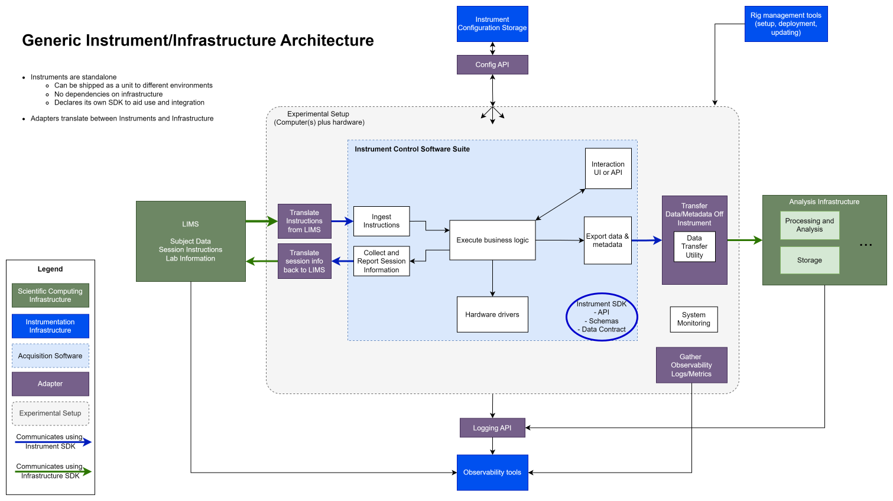

# Data Acquisition

This diagram represents a generic scientific experimental rig and how it integrates into the larger lab infrastructure at the Allen Institute. Different generic units of functionality are categorized as lab infrastructure, inherent to the instrument/experiment software, and adapters between infrastructure and the instrument.

## Design Principles

This architecture specifically emphasizes the separation between infrastructure and instrument/experiment. Many organically-grown projects end up with the acquisition software strongly coupled to the infrastructure surrounding it, and this has a number of unfortunate effects:
- Overly-coupled software cannot be run outside the lab in which it was written, which makes it very difficult to share. 
- If infrastructure is updated, stable lab software needs to be tweaked due to the external changes that are completely irrelevant to the main task it's performing. This violation of separation-of-concerns can be a significant maintenance burden and continually endanger the reliability of tools that should be static.

Thus, the following principles should be followed when designing an experimental system:
1. The acquisition software should be self-contained and able to stand on its own.
    - Its inputs and outputs should be clearly defined with API, schemas, and a data contract.
    - It should have no dependencies on infrastructure, and should be able to run in isolation or in a completely different lab environment.
2. Integrating such an instrument or experiment into lab infrastructure should be accomplished using adapters.
    - The Adapter pattern describes a layer between two well-defined entities that translates between them, eliminating the need for either side to fully "speak the language" of the other.
    - This adapter layer is ideally quite thin, and can be realized as multiple independent adapter scripts or a thin wrapper that contains the acquisition software.

It can be helpful to think of the acquisition software as a third-party component, for instance as if it were microscope software provided by a vendor. End users wouldn't be able to modify that software to make it talk to lab infrastructure, so even if the code is in-house, it shouldn't be made to depend on things irrelevant to its inherent functionality.

These guidelines result in experiments that are not only easier to maintain, but easier to export and share with the larger community. 

### At the Allen Institute

The generic architecture described here can be applied to many platforms at the institute, though some legacy projects do not cleanly separate experiment-specific functionality from infrastructure coupling. 

Additionally, while the following common tools exist, they are not universally used by every platform.

### Common tools

- [aind-watchdog-service](https://github.com/AllenNeuralDynamics/aind-watchdog-service), which facilitates transferring data off an experimental computer and triggering downstream processes.
- [lims_scheduler_d](https://github.com/AllenNeuralDynamics/LIMS-Scheduler), which performs the same function as aind-watchdog-service, but for Brain Science and legacy Mindscope projects.
- [waterlog](https://github.com/AllenNeuralDynamics/waterlog), which is the interface between users/experiments and the databases used to track mice and their weight/water records.
- [allen-powerplatform-client](https://github.com/AllenNeuralDynamics/allen-powerplatform-client), a python client library for communicating with the new MS PowerPlatform-based lab management system.
- [mpetk](https://github.com/AllenNeuralDynamics/mpetk), a legacy library used to communicate with lims2, mtrain, and SIPE's configuration and log servers.
- [log-schema](https://github.com/AllenNeuralDynamics/log-schema), utilities for writing structured logs with standardized formats and vocabulary.
- [Grafana Alloy](https://grafana.com/docs/alloy/latest/) and [Telegraf](https://www.influxdata.com/time-series-platform/telegraf/), observability tools to collect information and logs from lab computers.