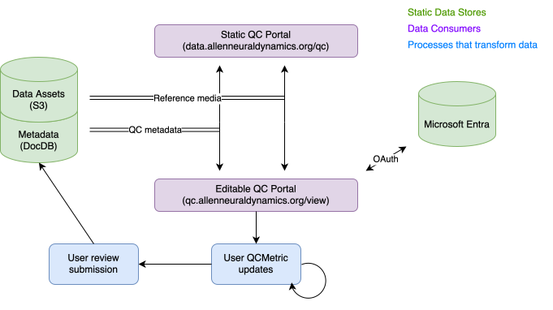

# Data Storage and Processing

## Code Ocean pipeline

Raw data lands in S3 as a single data asset that carries its `aind-data-schema`
metadata, with all of a session's modalities associated with one object.
Processing pipelines are modality-specific — each pipeline processes a single
modality. A pipeline outputs an NWB file along with `aind-data-schema` metadata,
including processing metrics and quality control artifacts and metrics. Once the
outputs have been QC'd, they can be combined into a final NWB file with its
associated metadata.

Each pipeline wraps modality- and platform-specific libraries that handle the
underlying data processing, quality control, and NWB packaging.

### Metadata in single-modality derived assets

Each modality-specific derived asset carries `aind-data-schema` metadata with the following conventions:

- **`data_description.json`** is regenerated with `data_level` set to `derived`. The `modalities` field lists only the modality processed by that pipeline (a subset of the raw asset's modalities). The `source_data` field records the name of the raw asset.
- **`subject.json`**, **`procedures.json`**, **`instrument.json`**, and **`acquisition.json`** are copied verbatim from the raw asset. For example, if a session recorded both behavior and electrophysiology, the `acquisition.json` in each derived asset will still describe both data streams; it is not filtered to the modality of that pipeline.
- **`processing.json`** is generated by the pipeline and describes the code, input parameters, and outputs.
- **`quality_control.json`** captures quality control artifacts and metrics produced by the pipeline.

### Common libraries

[aind-nwb-utils](https://github.com/AllenNeuralDynamics/aind-nwb-utils) : NWB File packaging manager.

[aind-metadata-manger](https://github.com/AllenNeuralDynamics/aind-metadata-manager) : Manages metadata generated in in each step of the pipeline and will output a complete, valid `aind-data-schema` metadata files at the end of the pipeline.

There are other tools but are common to modality / platform and not mentioned here.

## Quality control

Each pipeline produces quality control artifacts and metrics alongside its
processed outputs, captured in the asset's `aind-data-schema` metadata. These are
surfaced through the QC poratal where viewers can view and annotate their data assets.
data assets. The portal pulls QC metadata from the document database and displays
the corresponding reference figures from the Code Ocean data assets.

Reviewers use the portal to evaluate metrics marked `PENDING`, supporting AIND's
two-step quality control process: first assessing whether an asset's data is
suitable for analysis, then evaluating individual components (such as neurons)
within the asset for usability.

### Common libraries

[QC portal](https://github.com/AllenNeuralDynamics/aind-qc-portal) : A web application for viewing and annotating quality control metadata for AIND data assets.

