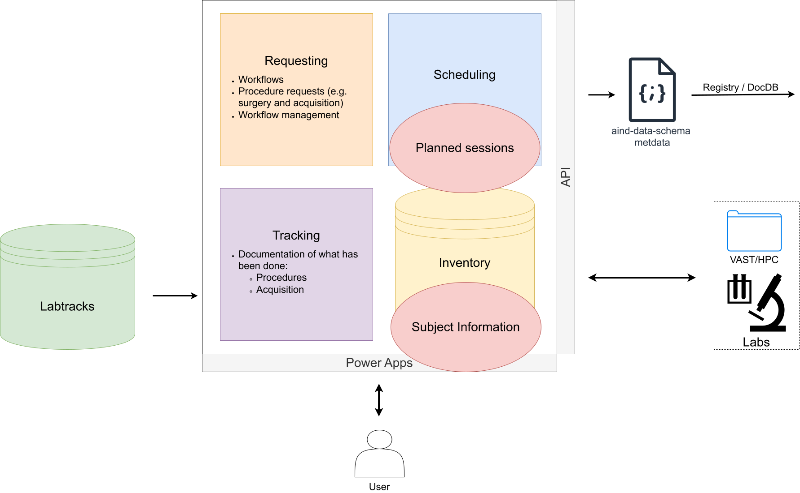
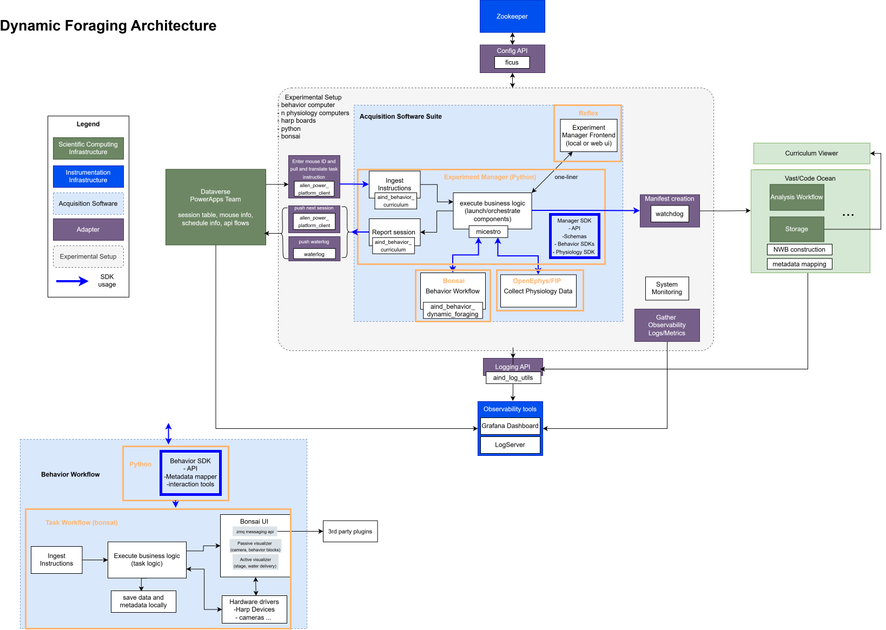
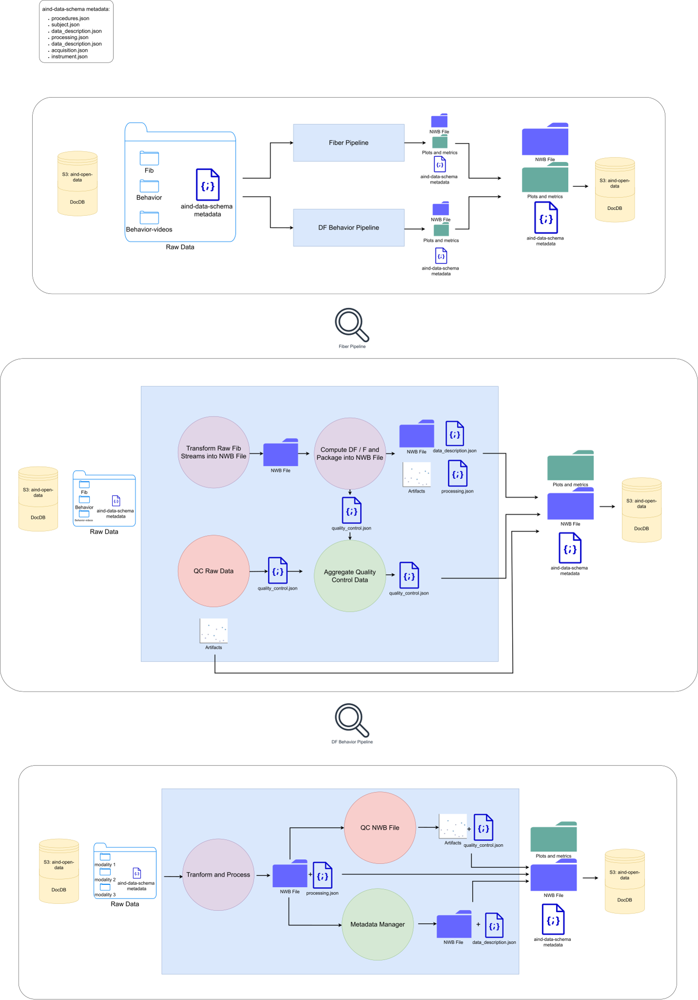
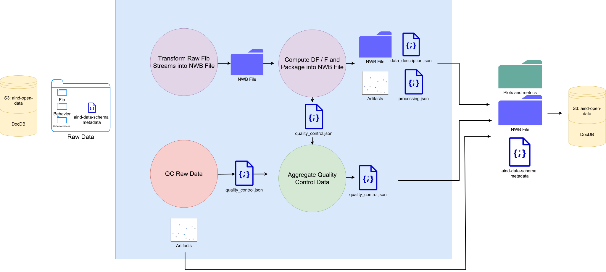
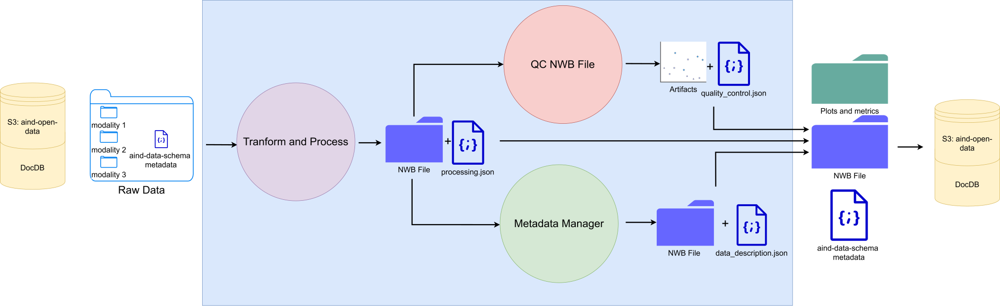

# Dynamic foraging diagrams

These diagrams outline the architecture of the Dynamic Foraging platform.

## Lab Management System

Dynamic Foraging relies on the lab management system for session and subject
planning. It also uses the system's water restriction tracking to support
behavior training.

## Data Acquisition

## Data Storage and Processing

### Mid-level Processing Pipeline

Data from Dynamic Foraging is processed by two pipelines — a behavior pipeline
and a fiber pipeline. Each runs independently and produces a modality-specific
NWB file when it completes successfully.

#### Fiber Pipeline

#### Behavior Pipeline

