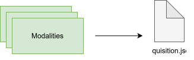
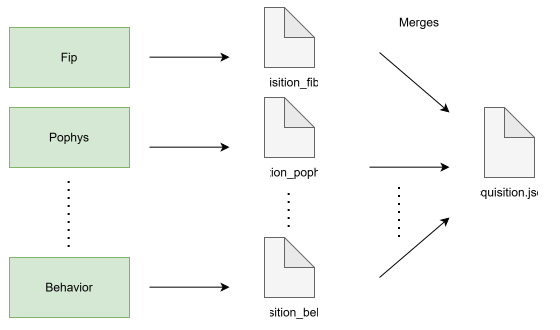
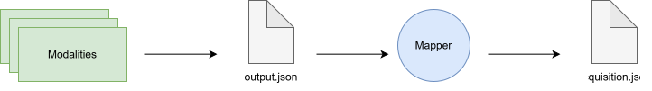
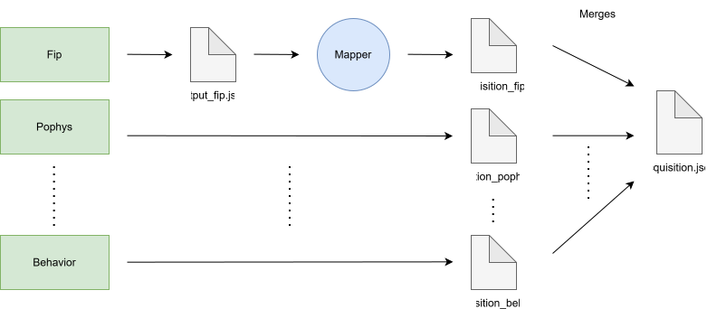

# Multimodal Data Acquisition

A single data acquisition session can use multiple modalities (e.g. behavior, fip, pophys) that record data simulatneously. In this case, there are several options for outputting metadata such that it adheres to the [aind-data-schema](https://aind-data-schema.readthedocs.io/en/latest/index.html) structure. The below diagrams use the `acquisition.json` file as an example, however the same patterns can be applied to `instrument.json` as well.

## 1. Using AIND Data Schema

### a. Single output file

The most straightforward scenario requires all modalities to write to the same JSON metadata file. The output should be formatted according to `aind-data-schema`.

### b. Per-modality output files

Alternatively, each modality can create its own JSON file that aligns with `aind-data-schema`. The most important consideration when combining metadata from multiple modalities is ensuring that unique fields match across files. For example, the `start_time` of the session should match across all modalities used in that session. More details on the merging process can be found on the [Upload Data page](../acquire_upload/upload_data.md#merge-rules).

## 2. Custom Schemas

The data transfer service also supports the ability to use a custom schema output for each modality. This follows an `extractor/mapper pattern`, where the `extractor` is the code on the rig outputting files and the `mapper` is a data contract between the output files and `aind-data-schema`. If you are interested in implementing this pattern for your modality, see the instructions on the [Acquire Data page](../acquire_upload/acquire_data.md#acquisition).

### a. Single custom output file

Similar to 1a, this scenario has all modalities writing to the same file, except this file outputs in a custom schema format. The result is passed to the mapper where a predefined data contract is used to convert the information to `aind-data-schema`. 

### b. Per-modality custom and standard output files

The `extractor/mapper` pattern can also be implemented on the per-modality level. For example, we currently maintain a custom mapping for `fip`, defined in [aind_metadata_extractor.models](https://github.com/AllenNeuralDynamics/aind-metadata-extractor/blob/main/src/aind_metadata_extractor/models/fip.json). As described in 1b, each modality writes to its own JSON file. The modalities that have a data model will be passed through a mapper before all files are merged together.

