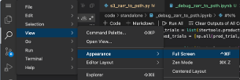

# Best practices for working in Code Ocean

If you are new to Code Ocean you may find the 101 series in the [training resources](https://alleninstitute.sharepoint.com/sites/AWS/Shared%20Documents/Forms/AllItems.aspx?FolderCTID=0x012000A09B1ADCA192D64C99E1504DAB6FBD2F&id=%2Fsites%2FAWS%2FShared%20Documents%2FGeneral%2FTraining) helpful as an initial starting point.

## General guidance

### Capsules vs Libraries

- Capsules should have a narrow, well-defined scope and leverage
  installable libraries as much as possible. Put another way, capsules
  should configure libraries to answer a question with specific data.

- Capsules can and should be re-usable, but ultimately the code in them
  should be relatively simple and specific to the question at hand.
  Generally, useful functions should find their way into libraries that
  can be installed into other capsules' environments.

- The code within a capsule should call library functions in a specific
  order or be dataset specific.

- By placing code in GitHub libraries, it's easier for code to be
  adopted by internal and external users for new purposes.


### Collaboration and GitHub

- Capsules are git repositories. They can be easily synchronized with
  GitHub if created with the "Clone from Git" option. Recommended
  workflow:

  - On GitHub, use the
    [aind-capsule-template](https://github.com/AllenNeuralDynamics/aind-capsule-template)
    repository to create your own repo.

  - In Code Ocean, create a new capsule via the "Clone from Git" option.
    Note that this will require github credentials to be added in your
    CO account settings.

  - After running "commit changes" in the capsule, you will see a "sync"
    button to sync your changes to (and others' changes from) github.
    
- When developing code, collaboration is best done on GitHub, not within
  Code Ocean. 

  - Individual contributors can work from their own capsules cloned from
    a shared github repository, and collaborate by syncing their own branches to github.
  - Alternatively, contributors can use completely different capsules that both
    depend on a single shared library stored on github, actively sharing changes there.


### Library Development

You can use Code Ocean to work with a library that is actively being
developed.

- To install a package from github in the environment builder, specify
  it in the format
  `git+https://github.com/<organization>/<package>.git#egg=<package>`
  (note that the package name appears twice). This will install and pin
  the latest version (by its commit hash), which you can force it to
  update on a future build by deleting the pinned version to move to the
  latest again (as with other environment builder packages).

- To edit the library from within Code Ocean: the above method produces an "editable"
  installation with source code in `/src`. You can access (and edit) this
  by "Add folder to workspace" in code-server/VS Code (not possible in JupyterLab). 
  Be **very careful** to sync your changes back to github when you edit -- 
  *they will be erased when the capsule is rebuilt*!

- Alternative approaches to developing a library:
  - If you primarily develop the code in a single capsule but want to make it
    available to other users and capsules:

    As long as the capsule is synced to github, you can make it installable as a library by simply
    creating a pyproject.toml in the root of the capsule. Follow the typical capsule layout
    with library modules in a subfolder of `code`, and point to that location from the pyproject.toml
    (along with setting appropriate dependencies etc).

  - If library code doesn't need to be actively tested on cloud data:
   
    Develop the library locally, sync changes to github, then update any capsules
    that rely on it: either reset the version and rebuild, or reinstall within a running
    workstation (`pip install -e git+https://github.com/<organization>/<package>.git#egg=<package>`)
    and don't forget to also update the environment on the next rebuild.

  - If you just want to briefly test and edit an existing library with cloud data:
    
    You can create a new capsule cloning the library's github repo directly. You will need
    to configure an appropriate environment after creating the capsule (if
    you own the repo you may want to save this by committing the
    dockerfile). After launching a workstation, install the library in
    place via `pip install -e .`

## Tips for Cloud Workstations

### JupyterLab 

- In a JupyterLab workstation, you can pop out notebook figures by right
  clicking and selecting "Create New View for Output." They won't be
  in floating windows, but you can keep them in view without scrolling
  and organize them within different tabs.

- Your matplotlib code runs, but the figures aren't displayed under your
  notebook cells? You likely need to set the backend of matplotlib to
  "inline" at the top of your notebook, using either:

  - `%matplotlib inline`

  - `get_ipython().run_line_magic('matplotlib', 'inline')`

### VS Code (code-server)

- Processes running in code-server will be terminated when the connection is closed,
  unlike in JupyterLab. Keep your tab open and avoid resetting your network connection
  (this can happen from connecting to a dock with wired ethernet, or switching routers).

- For best results, use a more recent version of code-server than the CO default:
  either by using a "code-server extensions pack" base image or editing your postInstall
  following [this example](https://github.com/tmchartrand/code-server-base-image/blob/master/environment/install_vscode)

- The code-server extensions pack environment has recommended settings preconfigured
  (as [machine settings](https://github.com/tmchartrand/code-server-base-image/blob/master/environment/files/vscode_machine_settings.json)). If not using this environment you may want to copy these
  manually, or at least *be sure to change the following essential settings*:

  - "Git: Use Integrated Ask Pass": False

      If your GitHub credentials are attached to your Code Ocean account,
      this will let code-server use those credentials rather than
      prompting you to log in to github for every git operation!

  - "Python: Language server": "Jedi"

      On certain versions of code-server, language server features like
      autocompletion and hints will not work in Jupyter notebooks with the
      default "Auto" setting. Alternatively, install the "basedpyright" extension, and set the
      language server to "None"

### Customization and Personalization

User-configured settings (e.g. themes, font color, etc) will generally
be saved when the workstation is on hold, but not when it is shut down and rebuilt.
If you want to customize your workstation more permanently, you can use the postInstall script to pull
configuration files from a github repo.

```bash
git clone <url-of-config-files>
# move files to relevant locations, typically within /root
```

- *This won't work for VSCode/code-server settings*, as those are stored
  inside the capsule filesystem (not available during the Docker build)
  -- on the plus side, setting changes here *are* persistent across
  rebuilds.

- Customizations of this nature are specific to code development, and
  shouldn't be included when sharing capsules with others. Before
  sharing the capsule, remove the customizations from the postInstall
  file.

## Tips for Pipelines

### Resource labels

Any pipeline with active usage beyond initial testing needs a unique label 
so we can monitor cost and execution. Create a nextflow.config file in the `pipeline` folder 
(same folder as the main.nf script) and put the following in it:

`process.resourceLabels = ['allen-batch-pipeline': 'YOUR-TAG-GOES-HERE']`

With the tag replaced by a short, unique, descriptive name for your pipeline.

### Template repository

Production-level pipelines should be based on the
[aind-pipeline-template](https://github.com/allenNeuralDynamics/aind-pipeline-template)
template repository. This includes a license, recommended nextflow config,
and automated versioning and release.

## Tips for building capsule environments

- If your environment build fails, find the issue by opening the build log
  (from the error message or the capsule timeline) and searching for errors, 
  typically towards the end of the log.

- When debugging a tricky build, you may consider making a few duplicates of the capsule
  so that you can test different variations simultaneously.

- To improve very slow builds, consider:
  - conda packages: make sure to use an environment with the mamba package manager instead of
    the older conda (both the "conda" and "mamba" entries will install via mamba).
  - pip packages: check the build log for extensive "backtracking" where pip tries many versions
    of a package sequentially in an attempt to resolve dependency conflicts. Pin the versions of
    these dependencies to eliminate this.

## How do I...?

### Install the GitHub Copilot extension in VSCode? 

The VScode in Code Ocean is actually code-server, which does not support
every extension in the VSCode extension marketplace. Instead, you can
use the following script to download and install extensions from the
official marketplace:
<https://gist.github.com/tmchartrand/0c46bdec6a4205aa7ce7555fd8f4c3b5>

(Note that Pylance is one extension that cannot be installed at all,
even using this workaround)

### Avoid reinstalling VSCode extensions every time I rebuild?

By default, extensions are not saved across rebuilds. You can, however, [configure
the postInstall script](https://gist.github.com/tmchartrand/5dfa687698cae6b349f86628de36f559) 
to either install a list of extensions *or* move the extensions
directory inside the capsule filesystem so manually installed extensions will persist
(both options are not possible together).
 
### Add model or simulation results as a data asset?

Save your model or simulation results as a data asset as you would any
other files produced during a capsule run. Output your files to the
"/results" folder and capture them by hovering over the result entry under
the run in your capsule timeline, then selecting "capture as data asset"
from the menu (⋮).

### Make my Streamlit app running in Code Ocean externally accessible?

Currently this is not possible.

### Keep variables in memory while shutting down cloud workstations?

Instance RAM state is not preserved when instances are paused. By
default, instances should remain live for 180 min before automatically
pausing. As a workaround, use a disk cache (on /scratch) to save results
for any slower-running functions -- in Python this can be as simple as adding a
decorator from the built-in joblib.
(<https://joblib.readthedocs.io/en/latest/memory.html>)

### Download a data asset to a local machine?

Generally, we should minimize how much data we are downloading from Code
Ocean. This is particularly true of larger data (GBs) that require long,
easily interruptible download times. That said:

- You can hover over most data assets in the My Data viewer and there is
  an option to download.

- If the data-asset is "external" then CO does not support direct
  downloads.

- You can run a cloud workstation, save the data-asset as a file in the
  "results" folder, and then download the dataset.

- s3fs is a python package for making AWS S3 bucket data look like files
  and folders.

### Generate interactive figures outside of a jupyter notebook?

Interactive figures that open in new windows (e.g. the "agg" or
"qt" backends for matplotlib) are not useable within the browser. 
For this reason, in-browser widgets like JupyterWidgets are the
preferred way to open interactive figures.

Python users: Code Ocean also is able to open streamlit applications
defined within a capsule. R users: the same is true for Shiny apps.

Other web apps (in addition to streamlit/shiny) can be
viewed by running in a vscode/code-server workstation and using the
built-in port-forwarding, which generates a link to access the web app
process in a new tab.

### Transition an existing capsule without a github link to a new github-backed capsule?

Follow the steps for cloning a capsule to generate a Code Ocean git URL
([https://docs.codeocean.com/user-guide/compute-capsule-basics/version-control/clone-via-git](https://docs.codeocean.com/user-guide/compute-capsule-basics/version-control/clone-via-git...)
), then use this URL to import a new repository into github
(<https://github.com/new/import> using your CO account email and API
token as credentials). Finally, create a new capsule on Code Ocean as a
clone of this new github repo.

### Add my github credentials to code ocean?

<https://docs.codeocean.com/user-guide/git-provider-integration-guide/setting-up-the-integration>

As shown in the docs, make sure to use a github **classic token** 
(<https://github.com/settings/tokens>), not a fine-grained token. 
If you are accessing internal repositories, you will also need
to select "Configure SSO" for the token and authorize it to access the relevant
organization.

### Start a workstation through Code Ocean and then SSH to it?

This is technically possible but not supported now. Compute instances
are in a private network that is not open to public SSH access. This is
a security best practice. That said, if there is sufficient demand for
this workflow we can look into supporting this ([comment
here](https://github.com/AllenNeuralDynamics/aind-code-ocean-info/issues/60)).

### Request a new base image?

Base images can come from any public docker image registry, but must be created by an admin.
Make a request by posting on the Code Ocean Teams channel or opening a github issue 
on the [SciComp requests board](https://github.com/AllenNeuralDynamics/aind-scientific-computing/issues).

(reduce-screen-real-estate)=
### Reduce the screen real-estate used by Code Ocean (full-screen mode)?

In Mac, press ^ + cmd + F, or see below. In Windows, press F11.



(create-nextflow-config)=
### Create a nextflow.config file to configure process execution?

Add a nextflow.config file to the pipeline directory. The process scope
controls process execution in the Nextflow workflow. Add the parameters
below to your nextflow.config file:

```nextflow
process {
  executor = 'awsbatch'
  queueSize = 100
  errorStrategy = 'retry'
  maxRetries = 20
  maxErrors = 100
}
```

`executor`: What is executing the pipeline.

`queueSize`: Number of parallel instances that can be executed at any
given time.

`errorStrategy`: How the pipeline should handle failures; in this case,
it will retry.

`maxRetries`: How many retries are performed.

`maxErrors`: Threshold for error accumulation in a given process.

Configuration white paper is found
[here](https://www.nextflow.io/docs/latest/config.html#configuration-file)
to see what other configurations are available.

## Bugs and other gotchas

### Jupyter notebook workstation fails to launch
- If you're trying to run Jupyter **notebook** and it fails to launch, you may
  be running an environment that has a recent version of JupyterLab (>4.0) without the
  notebook executable. You can fix this by:
  - If JupyterLab has been added to your conda package list, remove it
  - Add the "notebook" package to your conda package list.

### Pipeline API "permission denied" errors despite being able to run capsules

This problem can arise if two or more users collaboratively build a
pipeline together, and at least one capsule does not have sufficient AWS
credential secrets attached. This will show as a bypassable warning when
running the pipeline manually with "Reproducible Run", but will not run
via API. Attach AWS secrets to all capsules and the issue is resolved.