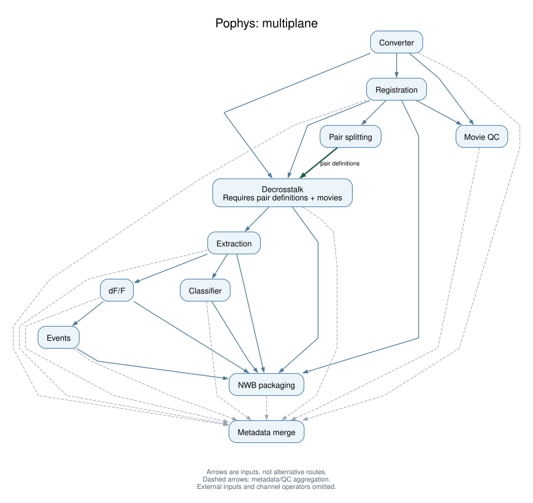

# Pophys portability: implementation record

This page records the pophys multi-backend work as of **2026-09-11**. It separates
completed implementation from proposed workflow and deployment work. General guidance
is in [Deploying pipelines across backends](multi_backend_pipelines.md).

## Scope and references

The goal is one hand-written Nextflow DSL2 workflow for Code Ocean, local Docker, and
SLURM, preserving the schema-v2 processing and output contracts. The initial image
scope is all eleven steps, each with its own image.

| Resource | Reference |
|---|---|
| Pipeline work | [aind-pophys-pipeline, `proj21/multi-backend-refactor`](https://github.com/AllenNeuralDynamics/aind-pophys-pipeline/tree/proj21/multi-backend-refactor) |
| Standards discussion | [aind-software-docs#214](https://github.com/AllenNeuralDynamics/aind-software-docs/issues/214) |
| Selected upstream workflow | [`745be7a`](https://github.com/AllenNeuralDynamics/aind-pophys-pipeline/tree/745be7a183c9b285f89105f7969a67ad9ad4b071) |
| Baseline and run parameters | [`pipeline/baseline.json`](https://github.com/AllenNeuralDynamics/aind-pophys-pipeline/blob/proj21/multi-backend-refactor/pipeline/baseline.json) |
| Source and image pins | [`pipeline/capsule_versions.env`](https://github.com/AllenNeuralDynamics/aind-pophys-pipeline/blob/proj21/multi-backend-refactor/pipeline/capsule_versions.env) |
| Full candidate digests and archive paths | [`candidate-inventory.json` at `4239566`](https://github.com/AllenNeuralDynamics/aind-pophys-pipeline/blob/4239566/environment/candidate-inventory.json) |
| Image recipes and operational instructions | [`environment/`](https://github.com/AllenNeuralDynamics/aind-pophys-pipeline/tree/proj21/multi-backend-refactor/environment) |
| Audited pipeline source | [`4a4d1e4`](https://github.com/AllenNeuralDynamics/aind-pophys-pipeline/commit/4a4d1e4c4433f563318ef33094a0a56281cf2653) |
| Latest confirmed full-length GHCR result | [Computation `1f313065`](https://codeocean.allenneuraldynamics.org/capsule/9120064/tree?results=1f313065-ac9c-4d1e-a4b5-edb0a4f6b3d1_computation) |
| Current development image digests | [`pipeline/development_images.env` at `042a09e`](https://github.com/AllenNeuralDynamics/aind-pophys-pipeline/blob/042a09e1d91dfd01cd91bf3ffef52849adb2e479/pipeline/development_images.env) |
| Ten procps replacement artifacts | [`environment/procps-fleet-inventory.json` at `042a09e`](https://github.com/AllenNeuralDynamics/aind-pophys-pipeline/blob/042a09e1d91dfd01cd91bf3ffef52849adb2e479/environment/procps-fleet-inventory.json) |
| Isolated development deployment | [Code Ocean pipeline 9120064](https://codeocean.allenneuraldynamics.org/capsule/9120064/tree), UUID `e4c03dcc-f43a-481c-ac55-257cfe538041` |

Workspace Project 19 owns the schema-v2 upgrade, Project 21 owns the portability
implementation, and Project 45 owns the standards documentation. Project-specific
choices here are not automatically organization-wide policy.

The design draws on the ephys `co-main` pattern and Camilo Laiton's *Pipeline deployment
guide - SmartSPIM example*. The SmartSPIM guide recommends standardized inputs/outputs,
one container per step, slim multi-stage builds, external data mounts, measured layer
sizes, prebuilt SIFs, and explicit SLURM GPU/resource settings. Its reported reduction
from 7.13 GB to 722 MB is a SmartSPIM example, not a measured pophys reduction.

## Selected baseline

### Workflow previews

Generated from the current portability workflow with Nextflow 24.10.4 `-preview`;
isolated local placeholders allow generation without processing tasks. Each diagram
selects one parameter branch. The initial nf-metro rendering obscured required
pair-splitting dependencies; the accepted Graphviz waterfall makes those explicit.
Graphviz
renders top-down arrows after paths through channel operators are collapsed,
preserving all process-to-process dependencies. Pair splitting is required input
to decrosstalk, not an optional route. Dashed arrows show metadata/QC fan-in to
the aggregator; other arrows may carry scientific data, provenance, or both.
The diagrams do not prove backend execution or expand per-plane task counts.

**Single-plane:**


**Multiplane:**



Source identity: [diagram provenance](../_static/pophys/provenance.json).
Regenerate with `scripts/render-diagrams.py` in the pipeline repository; the
raw DAGs are retained alongside its rendered SVGs.

### Baseline selection

The original portability refactor was committed at `6810bd6`, starting from an older
Project 19 workflow. Source inspection found that this older baseline did not contain
all later provenance improvements: for example, its extraction metadata used the
capsule URL and `VERSION`, not the installed backing-library identity.

The baseline refresh at `eb059d2` adopted workflow
`745be7a183c9b285f89105f7969a67ad9ad4b071`. This was explicitly selected using
[computation `eea0f242-8983-43e2-a367-430f33c60969`](https://codeocean.allenneuraldynamics.org/capsule/5409275/tree?results=eea0f242-8983-43e2-a367-430f33c60969_computation).
That run completed the eight-plane workflow with 60 processing records and 60
dependency-graph keys, 58 with upstream dependencies.

**This was a debug-length run, with root QC aggregation disabled.** It is not evidence
of full-length scientific validation at this revision. Earlier full-length parent and
child runs mapped to `d2821c3`; an earlier `3e87410` run also exercised root QC aggregation.
The selected revision includes later converter and Bergamo motion-correction fixes.

The logged Nextflow script fingerprint was matched to historical `main.nf` contents,
which were also compared with GitHub. The public computation endpoint did not expose
a complete immutable repository-snapshot commit. Companion configuration comes from
the selected Git revision; that distinction is retained in the baseline record.

The refresh preserves the portability abstraction and adds the selected capsule/library/
image pins, converter-to-motion provenance input, upstream processing documents staged
under NWB's `data/processed`, legacy metadata upgrade, and Cellpose/ROInet mounts.
The dormant converter-only stop guard was not carried forward. Repository defaults
were not changed to enable debug or disable QC merely because the evidence run did so.

## Metadata behavior and remaining gaps

The selected nine processing libraries use `aind-pophys-metadata` at
`adac8ebee57f895bb2d30b69cde01dd41afbce10`, with aind-data-schema 2.9.0 and
aind-data-schema-models 6.2.0.

The shared builder records the installed backing-library version and a repository URL
supplied by the consuming library. The capsule's `VERSION` is not the authoritative
processing-library version. Experimental revisions may still share a placeholder
package version, so exact source commits remain necessary for reproducibility.

Pipeline identity comes from `PIPELINE_NAME`, `PIPELINE_VERSION`, and `PIPELINE_URL`.
In schema 2.9.0, `Processing.pipelines` is a list of `Code` objects; each
`DataProcess.pipeline_name` must reference one of their names. The shared builder
omits pipeline linkage with a warning if all three variables are absent, and raises
if only some are supplied. This supports standalone steps; it is not a metadata-off mode.

The newer stage guard records timing, parameters, input artifacts, output summaries,
resources, dependencies, and errors. It attempts a processing document for failures
inside the guarded stage; it cannot guarantee metadata for failures before entry or
force-killed tasks. Per-step documents are combined through collision-safe numbered
staging directories. The aggregator owns root metadata output.

Metadata is also an input contract: decrosstalk reads upstream motion-correction
parameters. Removing metadata writers without changing consumers is unsafe.
There is no implemented fleet-wide metadata-off mode.

Remaining provenance work includes backend-independent pipeline identity injection,
exact source/container/model identities for development overrides, aggregator code
identity consistency, and required-output checks. Model SHA-256 reporting alone does
not enforce expected model contents. The published baseline's older resource and
version behavior should not be mistaken for the complete proposed contract.

## Image implementation

The image framework separates dependency inputs from the processing-library source
SHA, fetches authenticated Git sources separately from package build hooks, builds
noneditable wheels, and installs the processing library last. `images.tsv` defines
eleven distinct image identities. Shared recipes do not consolidate the stage images.

Dependencies were captured from exact Git objects rather than canonical clone HEADs.
The selected computation's full package log contained 9,664 tagged lines: 9,556 package
rows and 108 headers/separators. Repeated tasks agreed within each logged stage.
Those observations constrain a new dependency resolution rather than reinstalling the
entire inherited CO environment.

Build tools and temporary source trees stay outside final runtime images. Data and
model files remain external. CPU candidates use CPU Torch variants; the classifier
retains a CUDA-enabled runtime. These are deliberate environment changes requiring
scientific and GPU evaluation, not byte-identical historical rebuilds.

### Extraction's Conda and pip boundary

The successful extraction build log supplied for capsule `621b50b` identifies library
`d5b8b8c` and image tag `8e4ffe13e38690275e1273600f9e5cc7`. It resolved a reconstruction
error: the historical Conda and pip layers did not use identical package versions.

| Distribution | Before pip | After pip |
|---|---|---|
| h5py | 3.9.0 | 3.11.0 |
| Matplotlib | 3.8.0 | 3.10.9 |
| python-json-logger | 2.0.7 | 4.1.0 |
| PyYAML | 6.0 | 6.0.3 |
| typing-extensions | 4.7.1 | 4.16.0 |

The reconstructed candidate has 419 explicit Conda artifact URLs with SHA-256 hashes,
plus an 85-requirement pip lock. The overlay selects 47 requirements and leaves 38
same-version Conda distributions untouched. Only the five evidenced replacement pairs
are allowed. The historical log's 180-package transaction was an addition to an existing
base, not a complete environment inventory, so it is not directly comparable to 419.

CaImAn 1.10.3 comes from conda-forge, not the unrelated PyPI package named `caiman`.
Its dependency closure includes TensorFlow and notebook-related packages; these were
not silently removed. The log also establishes Suite2p commit
`ae0e9313b881f1d4bb51d7461f4796532a76e8aa`, replacing a floating branch in the candidate lock.

Conda's `opencv-python` 4.7.0 and pip's `opencv-python-headless` 4.11.0.86 both provide
`cv2`. The local candidate imported effective OpenCV 4.11.0 and CaImAn 1.10.3.
That establishes the candidate's import behavior, not complete ABI or scientific parity.

### Original local build results

Docker Desktop on Apple Silicon built all eleven candidates for Linux amd64. The
following are compressed layer totals, rounded to decimal MB/GB:

| Stage | Compressed size | Notable runtime requirement |
|---|---|---|
| Decrosstalk splitter | 77 MB | Standard-library Python, Bash/Git/timing; no h5py required |
| Converter | 484 MB | ScanImage/TIFF/HDF5; aind-ophys-utils 0.0.8 |
| Motion correction | 802 MB | Python 3.10, Suite2p 0.14.6, CPU Torch |
| Movie QC | 231 MB | Compiled OASIS dependency |
| Decrosstalk ROI images | 792 MB | Python 3.10 only, Suite2p 0.14.3, Cellpose 2.2.3 |
| Extraction | 1.70 GB | CaImAn/Conda plus reviewed pip overlay |
| dF/F | 624 MB | aind-ophys-utils 0.1.0 retained |
| OASIS | 229 MB | Compiled OASIS dependency |
| Classifier | 3.44 GB | CUDA, ROICaT's declared `all` extras, Tk runtime |
| NWB | 273 MB | PyNWB, HDMF and HDMF-Zarr |
| Metadata aggregator | 110 MB | aind-metadata-manager at `06ae879` |

Total compressed layers across the selected archives are approximately 8.76 GB,
before considering sharing or deduplication. Images were built across successive
recipe revisions, not one uniform source checkout. The full digests and exact archive
paths are in the linked candidate inventory.

Build attempts caught and corrected a missing variable in the smoke-check helper,
a base-image `wheel`/`packaging` mismatch, and the classifier's missing `libtk8.6`.
Successful builds imported actual library entrypoints, not just package roots.
OASIS paths also exercised a small numerical check. These checks do not establish
real-data scientific parity or classifier GPU execution.

The splitter source supplied for this work uses only `pathlib` and `json`, so its old
Vim/Jupyter/Conda/h5py environment is unnecessary. The aggregator's supplied wrapper
calls `aind_metadata_manager.metadata_manager.run()` and installs library
`06ae8790b1ecf106ea376ddc52785a027877a3d3` on Python 3.12. Both wrappers still use
CO-internal Git in the pipeline; creating their images did not migrate those sources.

## Publication and access

The inventory at `4239566` records all eleven local archives. Its verifier hashes
referenced manifests, configs, and layers before identifying a candidate for publication.
The historical policy update at `13be661` allowed Private or Internal GHCR packages
and rejected Public. Enterprise-wide authenticated access for Internal was explicitly
accepted after the first splitter publication.

The splitter was copied with Skopeo without rebuilding. Its remote digest exactly
matches the local archive:

```text
sha256:b2662185ab1a4f8374f1fc756f6c546429ee5d22783fafe124fd5c85311d4249
```

An inventory-driven publisher has been added locally. It audits the complete set
before uploading, skips matching remote tags, rejects conflicting digests and
unacceptable visibility, uses `--preserve-digests`, and records per-stage progress.
Initial publication completed on 2026-09-08 with all eleven packages Internal. A subsequent
read-only audit confirmed that every remote manifest digest matches its selected
local archive, with no failures or remaining uploads. This establishes artifact
publication, not backend execution or scientific parity. No production image pins
have been changed.

After CO could not authenticate a splitter pull, Sean explicitly approved public
distribution, stating that no image layers required privacy. All eleven packages
are now Public. This is an authorization record, not an independent license/secret
audit. Public package visibility applies to all versions/layers and cannot be
reverted to private. Source-repository visibility is separate. It was initially
unchanged, then the converter and movie-QC capsule repositories were made Public
after runtime clone failures; backing-library repositories remained unchanged. Publication tools
retain Private/Internal defaults and require exact `--allow-public-package` opt-ins.
No new source repositories were created during that publication step. The
[splitter repository](https://github.com/AllenNeuralDynamics/aind-ophys-decrosstalk-split-session-json)
now exists; creation alone does not change the pipeline's pinned CO source route.

Local setup distinguished three kinds of access: internal-source cloning, GHCR
read/write scopes, and organization SSO authorization. The original GitHub CLI token
could read source but lacked package scopes. Docker and Skopeo required separate
logins; the new package token also required SSO authorization before the first
organization upload succeeded. No token values belong in the repository.

The pipeline's `main` branch remains reserved for completed work. Because a new manual
Actions workflow cannot be dispatched before it exists on the default branch, the
selected build path was local Docker rather than changing `main`. Workflow files are
prepared, but local image builds and publication do not depend on their activation.

## CO probe failures and runtime correction

| Computation | Result |
|---|---|
| `2a88d727-966b-4b63-a661-eccdfa8963b1` | Intended smoke actually ran normal science: undeclared `ghcr_smoke_only` was ignored, debug resolved False, converter failed/retried, and Sean stopped the run. The available output did not establish a complete converter diagnosis. |
| `6d7decd5-e2bb-4199-8447-63c2c72c7228` | App Panel control now declared; correct smoke route, but GHCR unauthorized before startup. Public splitter access resolved that obstacle. |
| `29dae2af-9852-478f-8378-9e13fd58d2d9` | Public image pulled, but the metrics wrapper failed before the user script because `ps` was absent. SDK `end_status=succeeded` conflicted with exit code 1. |
| `18231fbb-991c-451e-8a39-f7a8a4cdb86d` | Procps splitter smoke passed: exit 0, expected marker, Python 3.12.14, x86_64, `scientific_processing=false`. The reported digest marker was declared, not independently measured. |
| `d793db9e-c4ab-4493-a22f-db14f526324e` | The all-image debug trial resolved all 46 parameters correctly and pulled the converter image, then failed before science because the task could not anonymously clone Private `aind-pophys-converter-capsule`. |
| `12fee57f-f150-43a7-b3d3-0f42cf96eca4` | Retry after converter and movie-QC capsule sources became anonymously accessible; same dataset and 46 parameters, with zero resolved mismatches. Subsequently completed with exit code 1. |

The initial claim that the first probe was smoke-only was corrected. The lesson is
to declare global controls and compare all resolved values immediately, not trust
the request's name or `named_parameters=true`. That API field belongs at the
top level, not in a query or process wrapper. UI stop preserved the mistaken run;
no deletion was used as a substitute for stopping.

The splitter recipe now includes procps and `ps --version`. Its
`candidate-procps-20260908` index digest is
`sha256:df5dcbec7a6eeae88c9fbd820665293a551adfd3470825ea1ff6d6916c1c37d4`;
the selected Linux amd64 manifest is
`sha256:c6ab7e57139ad47074aa15599f3a6d1aee41db05e1c2bdf8da21aebaf3e111b6`.
Skopeo inspection on macOS required explicit Linux/amd64 selection; a host-selection
failure was not evidence of failed publication.

All ten remaining runtime recipes received the same procps requirement. The first
converter rebuild failed fetching shared metadata `adac8eb` because the BuildKit
source token was absent; supplying a source secret fixed it. GHCR credentials did
not supply source access automatically. All ten builds then succeeded.

The replacement inventory records 10 candidates, 10 processed, 0 skipped/failed/
missing/parse failures, with archive blob checksums verified: 118 layers totaling
8,690,531,146 compressed-layer bytes; OCI archives total 8,690,798,080 bytes.
These are not deduplicated or extracted filesystem sizes.
This inventory is separate from the original eleven-image
inventory above. Subset-aware inventory/publication tools default to all eleven
stages, preserve digests, and remain read-only without `--execute`.
Sean confirmed ten uploads with zero failures; an independent remote audit matched
all ten digests. After he changed their visibility, all ten passed anonymous access
checks recorded in local `.image-work/procps-fleet-anonymous-audit.json`.
Inventory visibility/publication fields are creation-time snapshots, not live status.

Public image access and runtime source access are distinct contracts. A source audit
found that most processing capsule repositories were already Public, while converter
was Private and movie QC Internal. Sean made those two capsule repositories Public;
their exact pinned commits then became anonymously reachable. Internal backing
libraries and shared Git dependencies need not be public for this execution path
because they are installed into the image during an authenticated build. Splitter and
aggregator retain their existing Code Ocean-hosted source route.

Ephys's image-pull helper pre-populates a Singularity/Apptainer cache for local or
SLURM execution. It is not a Code Ocean AWS Batch prefetch stage: CO workers pull
task images independently. Pophys should add an equivalent digest-driven helper for
local/SLURM deployment, but it is not required for this CO retry.

## Development image selection and initial scientific trials

Commit `042a09e1d91dfd01cd91bf3ffef52849adb2e479` adds the development image
selector and the remaining runtime changes. `image_set=development-ghcr` selects
eleven immutable references from `pipeline/development_images.env` without a CO
registry prefix. The default selector preserves CO image behavior and
`capsule_versions.env` source/library pins. Invalid selectors, malformed digests,
and missing stages fail validation. This is not the proposed runtime library-SHA
override mechanism.

The App Panel declares `image_set`, `ophys_mount_url`, and `ghcr_smoke_only`
(default false). An attached `ophys_mount` asset,
`17ae3eed-ce82-47f1-ad54-1a597c39447c`, did not override the workflow's hardcoded
S3 input for session `multiplane-ophys_839909_2026-02-26_15-11-01`.
Sean selected reference asset `ff2fa171-9905-40d8-b058-cbf177e8cbb0`; the API
confirmed it ready with external bucket `aind-open-data` and prefix
`multiplane-ophys_849375_2026-06-20_13-13-04`. The trial explicitly supplies that
S3 URL. Attachments were not changed and can still be staged by CO.

After source verification, `client.pipelines.sync_pipeline` pulled one change,
pushed zero, and created no branch. Git's advertised `HEAD` was not treated as
proof of the UI-selected branch; an earlier contrary assertion was corrected.
The observed SDK was 0.16.0 on platform 4.7.3 (pipeline API minimum 4.6).

Scientific debug trial `d793db9e-c4ab-4493-a22f-db14f526324e` was submitted to the
isolated deployment. All 46 parameters matched the POST response: the baseline's
43 plus the three explicit image/smoke/input controls. In particular,
`image_set=development-ghcr`, `ghcr_smoke_only=false`, `debug=True`,
`acquisition_data_type=multiplane`, `aggregate_quality_control=0`, `init=mean`,
and processor Sean McCulloch. It failed before scientific processing at the
unauthenticated converter source clone. Retry
`12fee57f-f150-43a7-b3d3-0f42cf96eca4` uses the same contract after the two required
capsule sources became Public; it subsequently exited 1. No full-length, root-QC,
or scientific-parity claim follows from either run.

Workspace evidence is retained in
`temp/pophys-ghcr-probe/submit_scientific_trial.py` and
`scientific-trial/{sync,submission-intent,computation,parameter-check}.json`;
the pipeline-local proposed contract is
`.image-work/development-selection/proposed-debug-contract.json`.
Project 21's report `2026-09-08-23-16_development-ghcr-trials-and-decisions.md`
preserves the full decision/commit ledger and evidence paths. These local artifacts
are not published documentation links or evidence of a later run outcome.

## Confirmed execution and artifact evidence

The latest confirmed full-length GHCR computation,
[`1f313065-ac9c-4d1e-a4b5-edb0a4f6b3d1`](https://codeocean.allenneuraldynamics.org/capsule/9120064/tree?results=1f313065-ac9c-4d1e-a4b5-edb0a4f6b3d1_computation),
completed with exit code 0 in 30,499 seconds. Its 47 resolved parameters include
`debug=False`, `image_set=development-ghcr`, both smoke controls false, and root QC
aggregation disabled. It uses the selected eight-plane reference input above.

The bounded artifact inspection parsed 115 metadata documents and found real
scientific outputs for eight planes, root processing metadata with 60 process
records, 60 dependency-graph keys and 219 edges, and `nwb/pophys.nwb.zarr`.
NWB is a Zarr store, not a required `.nwb` file. Root QC absence is expected with
aggregation disabled. These are execution and structural checks, not numerical
equivalence or validation of every backend.

GPU smoke `885ad444-0aa5-4eae-844c-d1e7bdb31ec4` confirmed Tesla T4/CUDA visibility.
One-fork retry `b129f998-4b25-4522-a660-fe11b56140a5` and two-fork retry
`1d26f2e6-11d3-47e4-acf3-506ddc96f5f9` both succeeded while resuming
`ab61cd06-5728-4965-8948-24b63e5e3e7b`. They overlapped; they do not isolate a
failure cause or establish a controlled concurrency/performance comparison.
Preserve the working CO routing: direct `cpus 16`, `memory '60 GB'`,
`accelerator 1`, the `gpu` label, and classifier `maxForks 2`. The platform's
internal routing mechanism was not proven.

## Path-contract audit and remaining work

A source audit of 269 files at `4a4d1e4` found no fleet-wide configurable path
contract. Only converter, classifier and NWB receive pipeline I/O parameters;
only converter and classifier receive the temp parameter. Fixed task staging,
root links and `capsule/results` output globs remain independent of those values.
Converter child QC, motion preparation, classifier model staging and manager
legacy-upgrade temporary files have additional output/scratch bypasses.

Local/SLURM `DATA_PATH` binds a host directory to `/tmp/data`; Nextflow model
discovery still searches repository `data/` independently. The bind is not
configured read-only. Both roots must be satisfied until unified. The non-CO
configs do not supply the shared `PIPELINE_*` environment, and a late mounted
`pipeline_parameters.json` can overwrite parameters after validation and image
selection. POSIX publication defaults to symlinks, so retained work directories
or an explicit durable-publication strategy are required.

All eleven inspected OCI configurations target Linux amd64. Bash launchers and
root links do not establish native Windows support or unprivileged Apptainer
execution. The source audit is not a local/SLURM scientific run.

The splitter's new GitHub repository is not wired into the audited workflow.
The aggregator wrapper is being added on **main of the existing
[aind-metadata-manager](https://github.com/AllenNeuralDynamics/aind-metadata-manager)**;
no new aggregator repository is needed. A read-only check on September 11 found
main still at `2957483f4516d758f66851bddff605dd42d0e230`, without `code/run` or
`code/run_capsule.py`. The GHCR image already installs manager `06ae879`,
including the existing wrapper's `metadata_manager.run()` callable. A compatible
wrapper-only change may reuse that image; verify the landed wrapper before
changing source pins, and rebuild if its required library API/dependencies change.

The following still need implementation or data-backed evaluation:

1. Portable source hosting for the splitter and aggregator wrappers.
2. Consistent input/output/model staging and pipeline identity on each backend.
3. SLURM root-path handling, queue/GPU configuration, and SIF pre-pulling under normal user permissions.
4. Numerical comparisons on representative single-plane and multiplane inputs across backends, including required metadata and model provenance.
5. Local/SLURM classifier GPU validation and compatible host driver/runtime selection.
6. The exact-SHA development override workflow for independent processing/shared-library revisions.
7. Promotion of accepted candidate digests through a separate reviewed production change.

The experimental SLURM config adds a writable temporary overlay, but no cluster run
has established that root-level symlink creation is permitted. Explicit bind mounts
or a different path contract may still be required. Small image size and successful
imports must not be used as substitutes for these deployment checks.
